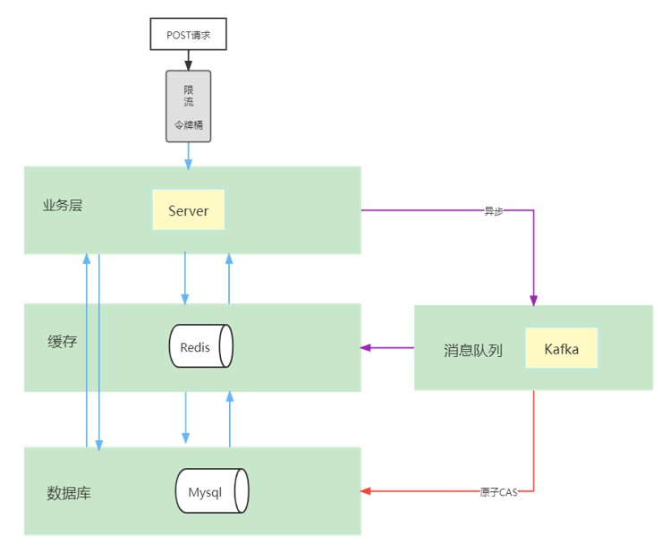
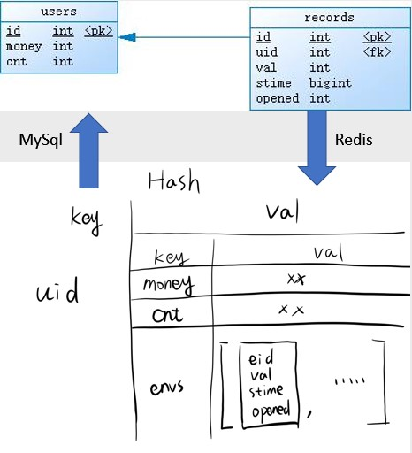
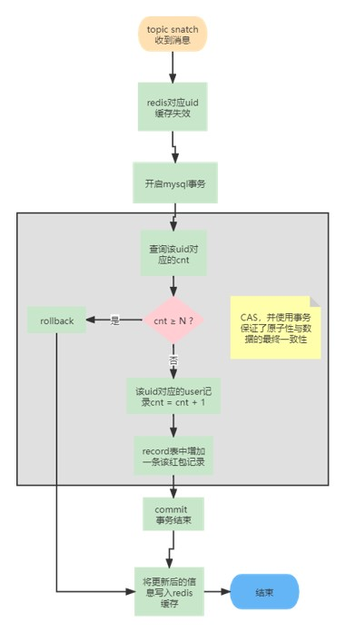
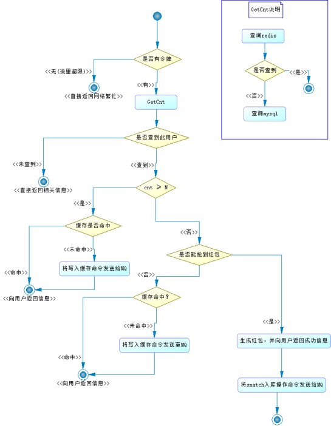
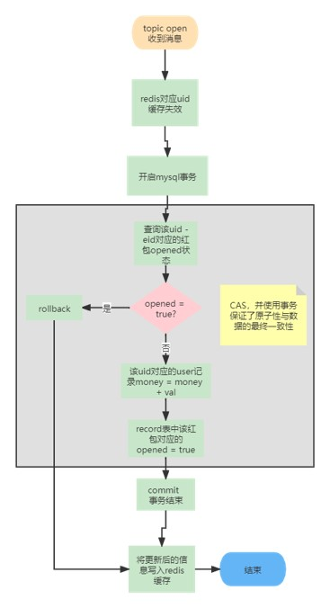
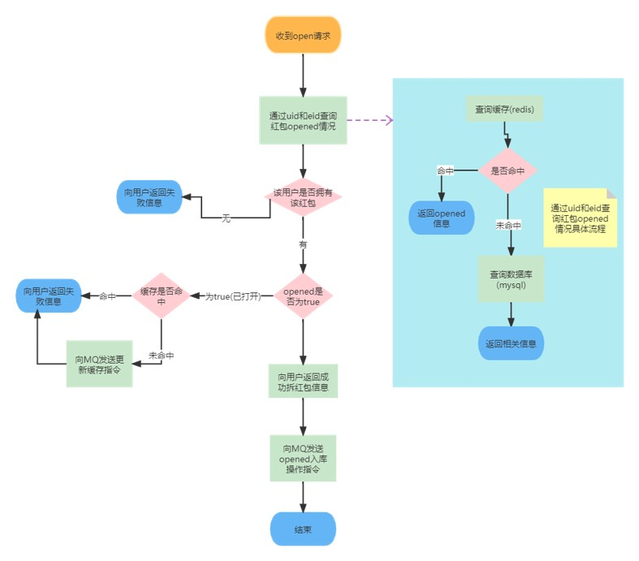
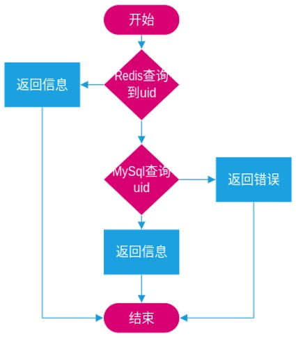
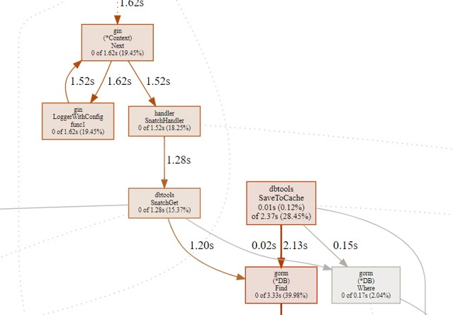
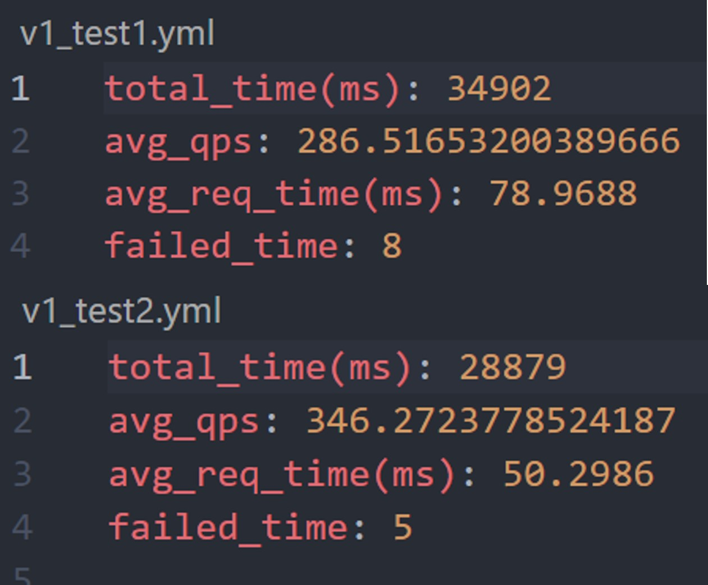
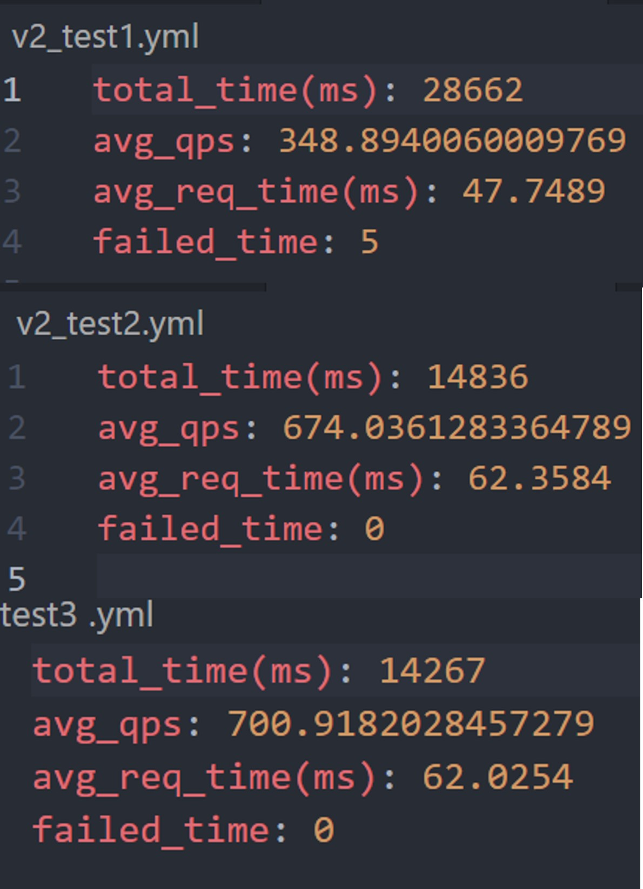

# 红包雨

## 项目背景

- 高并发场景

红包雨项目以字节跳动承办的春节红包雨项目为蓝图并简化，其面对的第一个问题就是对除夕当晚抢红包人群的超高并发

- 数据一致性

在进行现金相关项目的设计时，安全性与数据一致性是极为需要保障的内容。

## 需求分析

- /snatch 抢红包接口

  - 每个用户最多只能抢到 N 次，次数可配
  - 一定概率能抢到，概率可配置
    - 如何尽量恰好用完红包总额度？
    - 如何保证金额尽量平均？
    - 如何应对预算临时调整？
    - 如何应对客户端的超过限度的抢红包请求？

- /open 拆红包接口

  - 把红包拆开入账到钱包
  - 如何应对同一个红包的多次拆开请求？

- /get_wallet_list 钱包列表接口
  - 显示总余额
  - 显示抢到的红包，有已拆红包和未拆红包
  - 按红包获取时间排序
  - 红包雨的总金额、总个数、每个红包的金额范围可配置(配置文件)

## 项目设计

## 数据库建模

## 接口流程

### /snatch

### /open

### /get_wallet_list

## 红包池

- 为保证红包总量可调，项目使用红包池，使用实例内存保存。
- 当检测到红包池内红包数量低于某一阈值时，自动使用固定金额生成固定数量的红包（算法采用双倍均值算法）
- 当进入中期, 混合使用即时生成

## 稳流

- 令牌桶

  - 部署仅能使用 1 个实例，为了能保障服务的持续供给，使用令牌桶限制请求的速度

- 消息队列
  - 本项目使用 Kafka 作为消息队列，将写入操作异步给 MySql 数据库，其中事务保证了数据一致性

## 数据一致性保证

- 借鉴 Java 中 CAS 的思想，在最终写入 mysql 数据库的时候，首先开启事务，再次判断 cnt 是否已经达到 N，只有满足要求才会真正写入。
- 当然为了提高 QPS 与响应速度，用户侧已经拿到了信息，如果不满足要求并不会真正入库，而用户只是拿到了 fake 的信息。（流程图里有详细过程） 由于事务会锁住需要更新的行，并且有失败自动回滚的特性，可以保证数据的最终一致性。
- 我们利用数据库的事务，和直接在业务层利用锁相比，按 mysql 默认的可重复读隔离级别，不同 uid、eid 对应的操作可以同时进行互不影响，大大提高了并发性能

## 并发量

- 由于经过 pprof 的性能分析发现主要的性能瓶颈都在对数据库的访问上，便加了一层 redis 作为缓存，且 redis 缓存存储了完整的信息，所有业务都可以直接利用 redis 加快读取速度。
- 引入了消息队列，让入库操作可以与业务逻辑分离，一是解耦，二是异步处理提高了响应速度和并发量，将更新缓存、CAS 等操作放到消息队列里异步处理，而服务端可以立马返回结果，继续处理其他连接。

## 选型

- Kafka 性能更高，对于仅能部署一个实例的服务更适合

- 令牌桶相较于漏水桶更可控

- Mysql 对数据持久性、一致性的保证以及事务机制，是我们选择其作为后端数据库的原因，而由于我们需要更快的数据访问速度，所以选择加入了 Redis 作为一层缓存

## 测试与参数设置

- 由于本项目压测的特殊性，数据必须随机生成（不能每次都是同一个 uid），于是自己编写了压测小程序，主要流程为：
- 先随机好生成一定的数据放入对象池当中，再起一定数量的线程，并发地向服务器发送 POST 请求，同时记录全局发送请求总数与时间，得到 QPS；
- 记录每个请求从发出到得到响应的时间，利用 golang channel 的特性，求和，除以请求数量即可得到平均请求响应时间。

### v1 版本压测结果样例

### v2 版本压测结果样例(两台机器同时运行，即结果需要加在一起)

可以看到，在使用了缓存以及消息队列之后，QPS 可以达到 1000 左右，而请求的响应时间也不超过 100ms。

## 结论与反思

- 三个接口的实现，看似很简单，实则也很简单，如果只是完成功能，几乎没有难度。但是进阶的功能的实现却很困难，需要较深的设计功力与代码能力，而使用火山引擎部署代码也是一个挑战。
- 在项目设计的过程中，需要预留一些接口，方便后期的重构
- 进阶功能其实完成得有所欠缺，比如容灾方面，只有限流手段，并没有考虑到其他各种突发情况，以及服务的降级等。再比如性能方面，也只达到了 1000 QPS 以及 60ms 的响应时间
